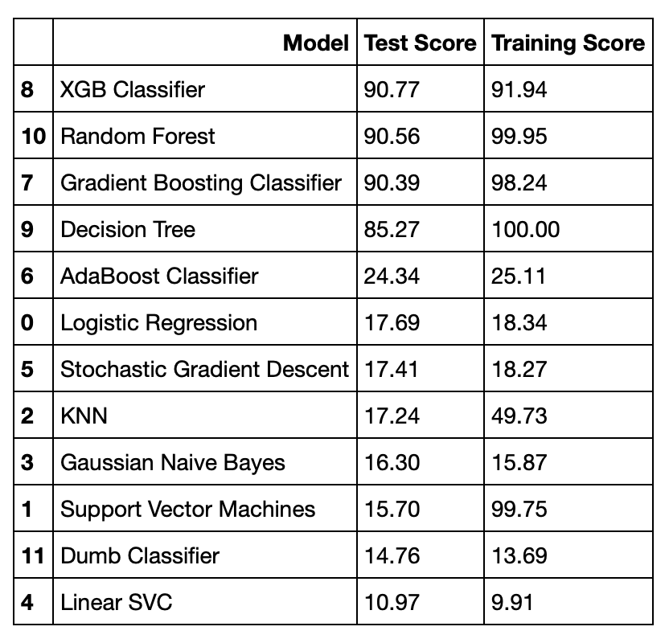

# Citation Prediction for NIPS Papers (1987-2017)

This repo includes our codes and report for our project in CSCI-544: Applied Natural Language Processing taught by Prof. May.

Group members:

 - Seyed Mohammad Asghari (asgharip@usc.edu)
 - Soheil Nazar Shahsavani (nazarsha@usc.edu)
 - Ahmad Fallahpour (fallahpo@usc.edu)
 - Mehrdad Kiamari (kiamari@usc.edu)

## Project Description
### Goal
The goal of this project was to predict the number of citations for the papers published in Neural Information Processing Systems (**NIPS**) conference, from 1987-2017 based on some information of these papers.

### Data collection
We collected information about all the papers published in Neural Information Processing Systems (**NIPS**) conference, from 1987-2017. 

The papers published in each year, are listed on the nips website [here](https://papers.nips.cc/book/advances-in-neural-information-processing-systems-26-2017). Each of the papers listed for an specific year, contains the following information:

- Title of the paper
- List of authors
- Abstract
- BibTex 

One of the challenges of our project was that NIPS website does not have the abstract for some of the papers (all the papers from 1987-2007). Additionally, we need the total number of citations for each paper and the affiliation of the authors. Therefore, we wrote a python script to extract these information from google scholar.

The details of the data collection step can be found in [here](./data_collection.md).

The outputs of this steps are 4 `.csv` files as follows.

- `Author.csv` that contains these columns: paper id, #citations, year, Author0, Author1, …
- `Abstract.csv` that contains these columns: paper id, #citations, year, Abstract
- `Affiliation.csv` that contains these columns: paper id, #citations, year, Affiliation0, Affiliation1
- `Title.csv` that contains these columns: paper id, #citations, year, Title

### Data processing

We use this IPython Notebook [`split_train_test.ipynb`](./split_train_test.ipynb) to divide the data set (the above 4 `.csv` files) into the following training and test sets:

#### Training sets:
`Author_training.csv`, 
`Affiliation_training.csv`, 
`Title_training.csv`, 
`Abstract_training.csv`.

#### Test sets:
`Author_test.csv`, 
`Affiliation_test.csv`, 
`Title_test.csv`, 
`Abstract_test.csv`.

Then, we use these two IPython Notebooks [`author.ipynb`](./author.ipynb) and [`affiliation.ipynb`](./affiliation.ipynb) to generate following csv files:

`Author_train_predicted.csv`, 
`Author_test_predicted.csv`, 
`Affiliation_train_predicted.csv`, `Affiliation_test_predicted.csv`.

Next, we use the IPython Notebook [`title.ipynb`](./title.ipynb) to generate following files:

`Title_training_predicted.csv`, 
`Title_test_predicted.csv`.

Next, we use the IPython Notebook [`abstract.ipynb`](./abstract.ipynb) to generate following files:

`Abstract_training_predicted_[method].csv`, `Abstract_test_predicted_[method].csv`,

where `mode` can be `nltk`, `textblob`, or `rake`.

### Classification

We use a variety of models from `Scikit-learn` package for implementing the classifier. The inputs to this classfication problem are:

#### Training dataset: 
* `Author_train_predicted.csv` 
* `Affiliation_train_predicted.csv`
* `Title_training_predicted.csv`
* `Abstract_training_predicted_[mode].csv`

#### Test dataset:
* `Author_test_predicted.csv`
* `Affiliation_test_predicted.csv` 
* `Title_test_predicted.csv`
* `Abstract_test_predicted_[method].csv`

where `mode` can be `nltk`, `textblob`, or `rake`.

The details of the classification step can be found in the IPython Notebook [`classification.ipynb`](./classification.ipynb). In our classification task, since the number of labels is 3, one baseline approach is to choose of the 0, 1, or 2 labels randomly. This approach results in the accuracy of %33.33 for the training and test sets. A better baseline can be obtained by looking at the training set and find the most frequent label and use it for the test. We call this approach, Dumb Classifier.

### Todos

 - Write the code structure
 - ...
