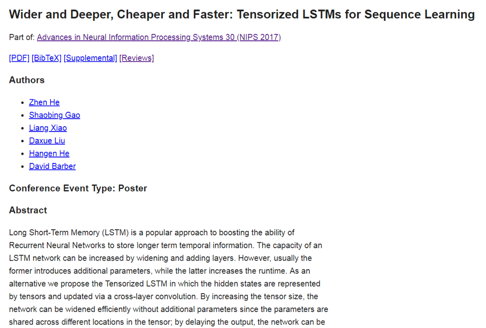
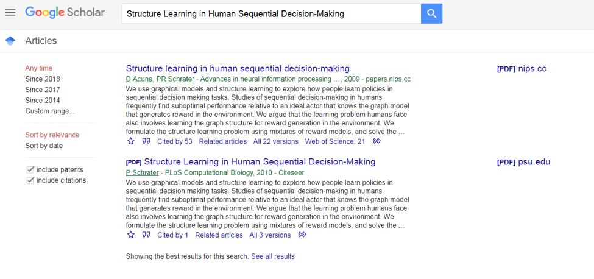
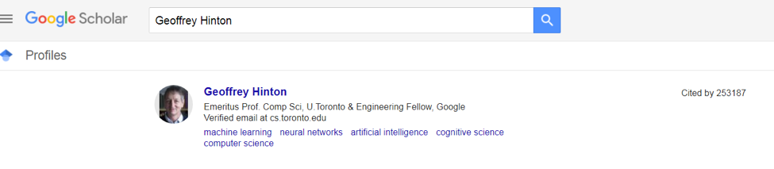
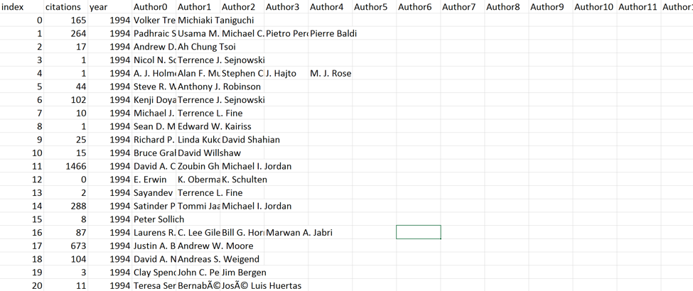
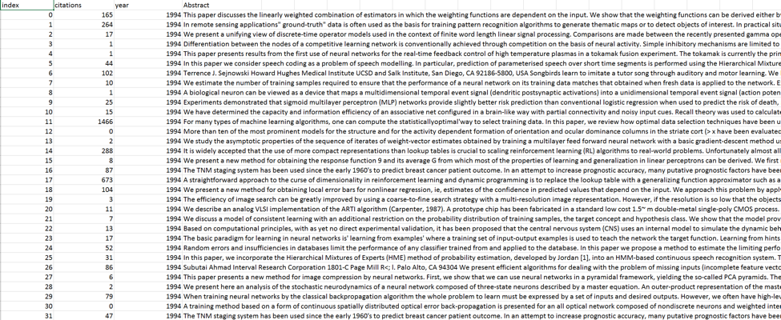
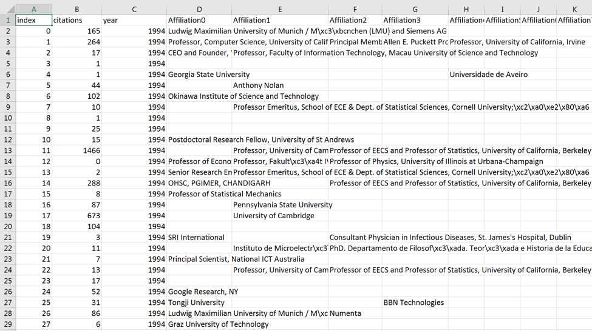
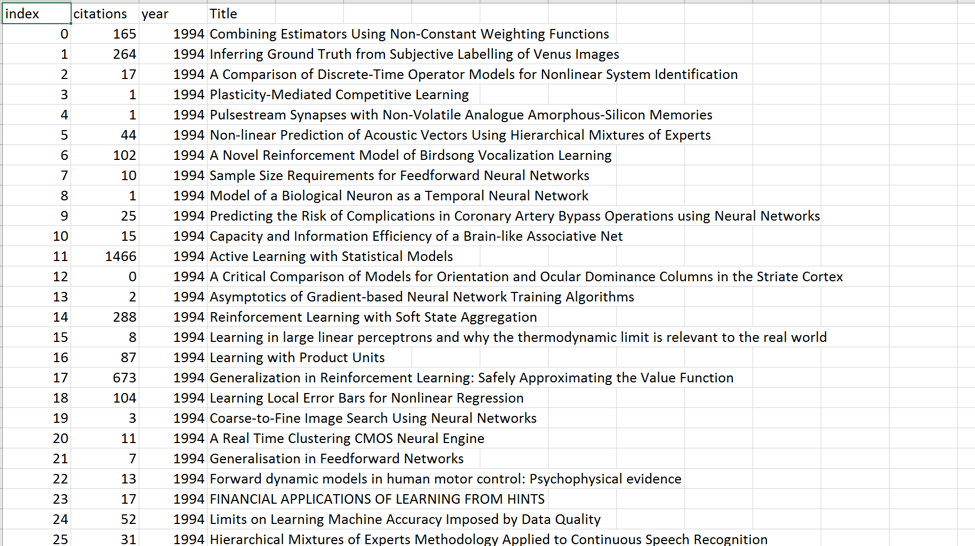

# Data collection
We aimed at collecting information about all the papers published in Neural Information Processing Systems (**NIPS**) conference, from 1987-2017.

The papers published in each year, are listed on the nips website [here](https://papers.nips.cc/book/advances-in-neural-information-processing-systems-26-2017). Each of the papers listed for an specific year, contains the following information:

- Title of the paper
- List of authors
- Abstract
- BibTex 

An example of one of the papers published in NIPS 2017 is shown in the following figure:

In order to extract all these information, we modified an existing web crawler called *Crawler4j*.

For each year (in the range of 1987-2017) we provided the link ([https://papers.nips.cc/book/advances-in-neural-information-processing-systems-26-xxxx](https://papers.nips.cc/book/advances-in-neural-information-processing-systems-26-xxxx)) as the initial seed for the crawler, and limited the `max depth` of crawling to 2, as we only need the crawler to open the link for each of the papers, and parse the information listed above.

As a result, for each paper in each year, a simple text file is created which contains the title of the paper, the name of the authors, the abstract, and finally the bibtex.

One of the problems with this approach is that NIPS website does not have the abstract for some of the papers (all the papers from 1987-2007). Additionally, we need the total number of citations for each paper and the affiliation of the authors. Therefore, we wrote a python script to extract these information from google scholar.

Google scholar does not provide and API, that enables machines to extract the data from their database easily. As a result, we used an existing python library (`scholarly`) to extract the required information from google scholar. This library queries the google scholar website with some parameters, such as title of a paper or name of an author, and returns some information extracted from the html code of the google scholar.

Below is an example query to google scholar:

The scholarly library returns the information for the first item listed. It contains the total number of citations for the paper, and some parts of its abstract. Additionally, some information about authors such as their affiliation, and total number of citations can be extracted using scholarly.

Below is an snapshot of results of searching Geoffrey Hinton in google scholar:

Consequently, for each paper in our data set, we extracted the total number of citations, and affiliations of all the authors using a script that uses the scholarly library.

One of the main issues was that google scholar blocks IPs based on the total number of queries issued by each IP address and their frequency. To solve this problem we came up with two different solutions:

 1. To increase the time between consequent queries to 30 sec.
 2. To design a rotating proxy server which changes the IP address constantly to avoid being block due to too many requests.

Finally, after gathering all the data from google scholar, an example of a text file for one NIPS paper is as follows:

> Title:   
> Pixels to Graphs by Associative Embedding   
> Authors:  
> Alejandro Newell   
> Jia Deng   
> Abstract: (From NIPS website)   
> Graphs are a useful abstraction of image content. Not only can graphs represent details about individual objects in a scene but they can capture the interactions between pairs of objects. We present a method for training a convolutional neural network such that it takes in an input image and produces a full graph definition. This is done end-to-end in a single stage with the use of associative embeddings. The network learns to simultaneously identify all of the elements that make up a graph and piece them together. We benchmark on the Visual Genome dataset, and demonstrate state-of-the-art performance on the challenging task of scene graph generation.   
> Bibtex:  
> @incollection{NIPS2017_6812, title = {Pixels to Graphs by Associative Embedding}, author = {Newell, Alejandro and Deng, Jia}, booktitle ={Advances in Neural Information Processing Systems 30}, editor = {I. Guyon and U. V. Luxburg and S. Bengio and H. Wallach and R. Fergus and S. Vishwanathan and R. Garnett}, pages = {2171--2180}, year = {2017}, publisher = {Curran Associates, Inc.}, url ={http://papers.nips.cc/paper/6812-pixels-to-graphs-by-associative-embedding.pdf}}   
> Citations: (From Google scholar)   
> 13   
> Abstract: (From Google scholar)   
> Graphs are a useful abstraction of image content. Not only can graphs represent details about individual objects in a scene but they can capture the interactions between pairs of objects. We present a method for training a convolutional neural network such that it takes in an input image and produces a full graph definition. This is done end-to-end in a single stage with the use of associative embeddings. The network learns to simultaneously identify all of the elements that make up a graph and piece them together. We benchmark on the …   
> Affiliations: (From Google scholar)   
> University of Michigan  
> Princeton University

After this step, we wrote a script in python that goes through all the text files for papers and creates multiple `.csv` files and the final data set in `.json` format.

The `.csv` files are as follows.

- `Author.csv` that contains these columns: paper id, #citations, year, Author0, Author1, …
- `Abstract.csv` that contains these columns: paper id, #citations, year, Abstract
- `Affiliation.csv` that contains these columns: paper id, #citations, year, Affiliation0, Affiliation1
- `Title.csv` that contains these columns: paper id, #citations, year, Title

The following figures show examples of these 4 files:

- `Author.csv`

- `Abstract.csv`

- `Affiliation.csv`

- `Title.csv`

These `.csv` files are further used to generate features for our training and test data sets.